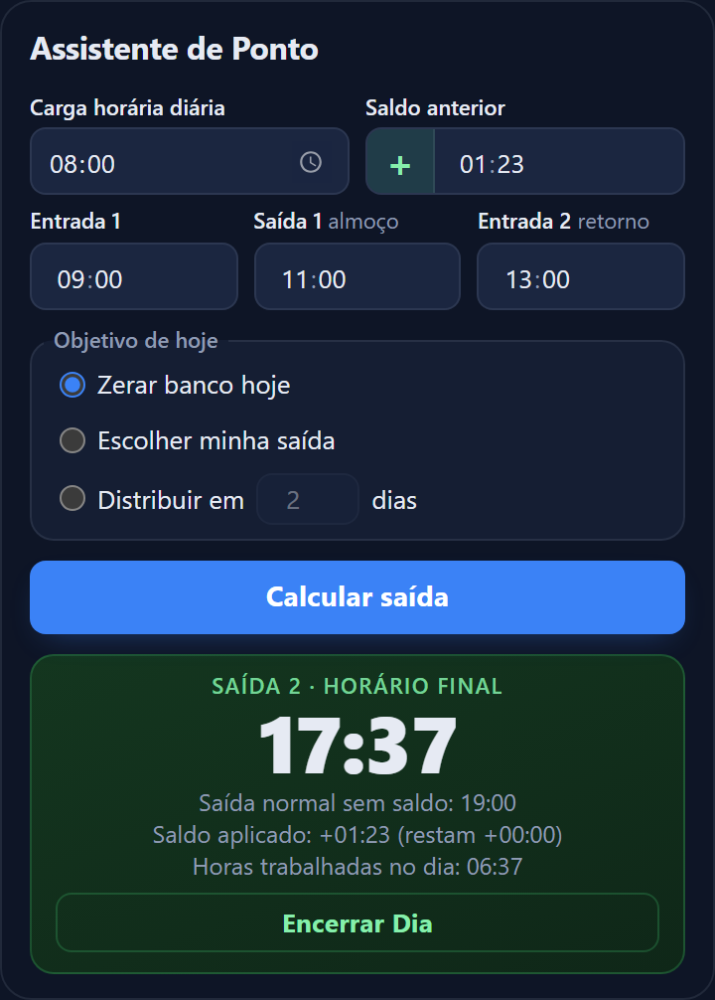
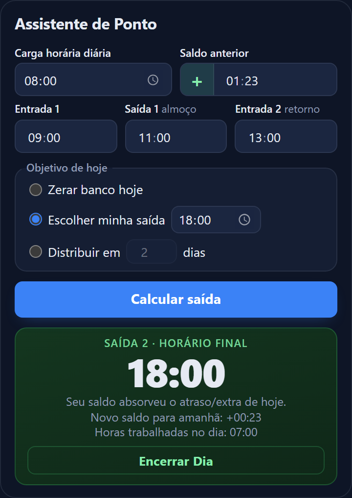
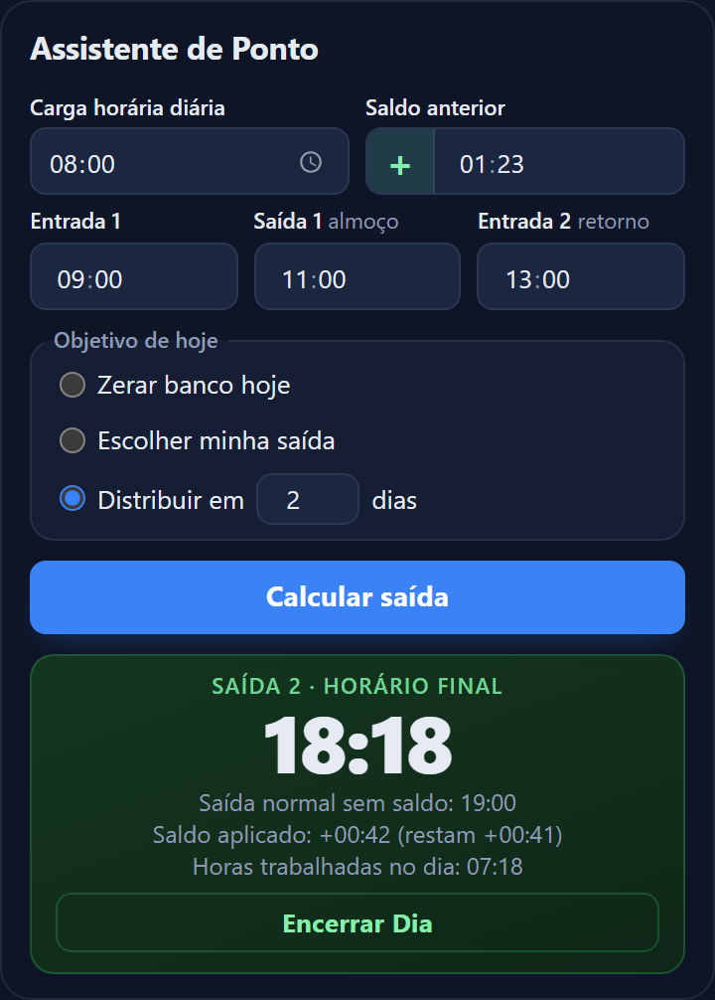

# ⏱️ Assistente de Ponto

**Descubra *hoje* a que horas você pode ir embora, usando o seu banco de horas como escudo, sem hora extra involuntária.**

Extensão para Chrome (Manifest V3) e página web estática, feita só com HTML, CSS e JavaScript puro. Sem frameworks, sem build, sem servidor.

<p>
  
  
  
  
</p>

### 👉 [Testar a versão web](https://izabelygraebin.github.io/calculadora_de_ponto/)

---

## 🎯 O problema

O sistema oficial de ponto da empresa só atualiza o seu banco de horas **no dia seguinte**. Mas a decisão de sair é *hoje*:

- Você entrou às 09:00 em vez das 08:00. Sua "saída normal" foi empurrada para as 19:00.
- Seu saldo do banco de horas é **+01:23**. Ou seja, a empresa já deve essas horas a você.
- Você quer usar o saldo para cobrir o atraso e sair no seu horário de costume, **sem ficar além da hora e sem virar hora extra sem querer**.

Fazer essa conta de cabeça (entrada, almoço, retorno, saldo, minutos e base 60) é um convite ao erro. O Assistente de Ponto faz por você, com uma trava de segurança: pela CLT a jornada não pode passar de **2 horas extras por dia**, e ele **bloqueia qualquer cálculo que ultrapasse esse limite**.

> Serve também para o caminho inverso: com saldo **negativo**, ele mostra o quanto você precisa compensar e ajuda a distribuir isso em vários dias, sem estourar o limite diário.

---

## ✨ Os três modos

Todos usam os mesmos dados do exemplo acima: carga de **08:00**, saldo **+01:23**, entrada às **09:00**, almoço das **11:00** às **13:00** (saída normal sem saldo: **19:00**).

<table>
  <tr>
    <td align="center" width="33%"><b>1. Zerar banco hoje</b></td>
    <td align="center" width="33%"><b>2. Escolher minha saída</b></td>
    <td align="center" width="33%"><b>3. Distribuir em X dias</b></td>
  </tr>
  <tr>
    <td></td>
    <td></td>
    <td></td>
  </tr>
</table>

| Modo | Pergunta que responde | Resultado no exemplo |
|---|---|---|
| **Zerar banco hoje** | "A que horas eu posso sair usando *todo* o meu saldo?" | Sai às **17:37**. O saldo vai para `+00:00`. |
| **Escolher minha saída** | "Eu vou sair às 18:00. O que acontece com o meu banco?" | Sai às **18:00**. O saldo passa de `+01:23` para **`+00:23`**. |
| **Distribuir em X dias** | "Quero abater só um pouquinho por dia." | Em 2 dias, sai às **18:18** e restam `+00:41` para amanhã. |

### Como cada modo pensa

- **Zerar banco hoje**: aplica o saldo inteiro. Com saldo positivo você sai o mais cedo possível. Com saldo negativo você fica além da hora para quitar a dívida de uma vez, se isso couber nas 2 horas extras diárias.
- **Escolher minha saída**: o cálculo é *invertido*. Você diz a hora em que quer sair (ex.: 18:00), e a extensão calcula quanto tempo você trabalhou, compara com a carga do dia e mostra o **novo saldo para amanhã**. É a opção para quem já tem um horário de costume e quer só saber o custo dele no banco.
- **Distribuir em X dias**: aplica `saldo ÷ X` por dia. Ideal para compensar um saldo negativo grande sem ultrapassar o limite legal. Se você tentar quitar `-05:00` de uma vez, o app avisa e sugere dividir em **pelo menos 3 dias**.

### Fechando o dia

O botão **Encerrar Dia** transforma o "restam" no novo *Saldo anterior*, limpa Entrada 1, Saída 1 e Entrada 2 para o dia seguinte e, em "Distribuir em X dias", reduz X em 1. Quando chega em 1 dia, volta sozinho para "Zerar banco hoje".

---

## 🧮 Como o cálculo funciona

Todos os horários são convertidos para **minutos absolutos** antes de qualquer conta, o que evita os erros clássicos de base 60.

```
A) turno 1        = Saída 1 − Entrada 1                  (11:00 − 09:00 = 02:00)
B) falta hoje     = Carga diária − turno 1               (08:00 − 02:00 = 06:00)
C) saída base     = Entrada 2 + falta hoje               (13:00 + 06:00 = 19:00)
D) saída final    = saída base − saldo aplicado          (19:00 − 01:23 = 17:37)
```

- Saldo **positivo** (horas a favor): a saída **diminui**.
- Saldo **negativo** (horas devidas): a saída **aumenta**.
- **Trava trabalhista**: se a jornada total passar de *carga + 2h*, o cálculo é bloqueado com o aviso "Cuidado: Excede o limite legal de 2 horas extras diárias".

O card de resultado mostra ainda a **Saída normal sem saldo** (a saída de hoje se você não usasse o banco) e as **Horas trabalhadas no dia**, para você entender de onde veio cada número.

---

## 🚀 Instalação local no Chrome (Modo Desenvolvedor)

1. Baixe ou clone este repositório:
   ```bash
   git clone https://github.com/izabelygraebin/assistente-de-ponto.git
   ```
2. No Chrome, abra `chrome://extensions`.
3. Ative o **Modo do desenvolvedor** (canto superior direito).
4. Clique em **Carregar sem compactação** e selecione a **pasta do projeto** (a que contém o `manifest.json`).
5. Fixe o ícone 🕐 na barra do Chrome e clique nele para abrir o assistente.

> Ao instalar, o Chrome pode avisar que a extensão "lê dados" dos sites Ahgora e Pontomais. É a base para a futura leitura automática do saldo (veja o [roadmap](#-roadmap)). Hoje o script desses sites está vazio e **nada é lido nem enviado**.

Na extensão, os dados ficam em `chrome.storage.sync` e acompanham a sua conta Google.

### Versão web

O `index.html` na raiz roda como um site comum e usa `localStorage` quando não está dentro de uma extensão. Para testar localmente:

```bash
# na pasta do projeto, com Python...
python -m http.server 8000
# ...ou com Node
npx serve .
```

Depois abra `http://localhost:8000`. Para publicar no **GitHub Pages**: *Settings → Pages → Deploy from a branch →* branch principal, pasta `/ (root)`.

Na web os dados ficam **só no seu navegador** (não sincronizam entre dispositivos e não há servidor, cookie ou rastreamento).

---

## 🧭 Metodologia: Spec-Driven Development (SDD)

Este projeto foi construído seguindo **Spec-Driven Development**: primeiro a especificação, depois o plano, depois o código. As regras de negócio são escritas na spec antes de virarem código.

| Arquivo | Papel |
|---|---|
| [`spec.md`](spec.md) | **Fonte da verdade.** Problema, regras de cálculo, validações trabalhistas e comportamento da interface. |
| [`TODO.md`](TODO.md) | **Plano de ação.** Tarefas pequenas e ordenadas, marcadas ao concluir. |
| [`CLAUDE.md`](CLAUDE.md) | **Regras do projeto** para o assistente de código: padrões, arquitetura MV3 e a "regra de ouro". |

A **regra de ouro** do projeto: *não alterar a lógica de horários, o armazenamento ou o `manifest.json` sem antes consultar e atualizar a spec, e não pular etapas do plano.* Cada nova funcionalidade (por exemplo, o modo "Escolher minha saída" ou o "Encerrar Dia") nasceu como uma mudança na spec, depois virou tarefa no TODO e só então virou código.

---

## 🗂️ Estrutura do projeto

```
├── manifest.json          # Extensão Chrome (Manifest V3)
├── index.html             # Versão web estática (espelha popup/popup.html)
├── popup/
│   ├── popup.html         # Interface da extensão
│   ├── popup.css          # Tema escuro
│   └── popup.js           # Lógica pura de cálculo + interface
├── scripts/
│   ├── storage.js         # Armazenamento: chrome.storage.sync → localStorage → memória
│   ├── background.js      # Service worker (sem DOM)
│   └── content.js         # Reservado para a V2
├── icons/
├── docs/screenshots/      # Imagens deste README
├── spec.md · TODO.md · CLAUDE.md
```

A lógica de cálculo (`calcular`, conversões de HH:MM ⇄ minutos, máscara dos campos) fica no topo do `popup.js`, isolada do DOM e do storage, o que a torna simples de testar.

---

## 🛣️ Roadmap

- [x] Três modos de compensação e trava de 2h extras
- [x] Encerrar Dia com retroalimentação de saldo
- [x] Versão web estática com fallback para `localStorage`
- [ ] **V2:** leitura automática do saldo direto do sistema de ponto (Ahgora / Pontomais) via *content script*

---

## ⚠️ Aviso

O Assistente de Ponto é uma **ferramenta de apoio ao planejamento**. Ele **não substitui** o sistema oficial de ponto da sua empresa nem orientação jurídica. Regras de banco de horas e de limites de jornada podem variar conforme acordo individual, convenção ou acordo coletivo, então confira sempre o que vale para você.
